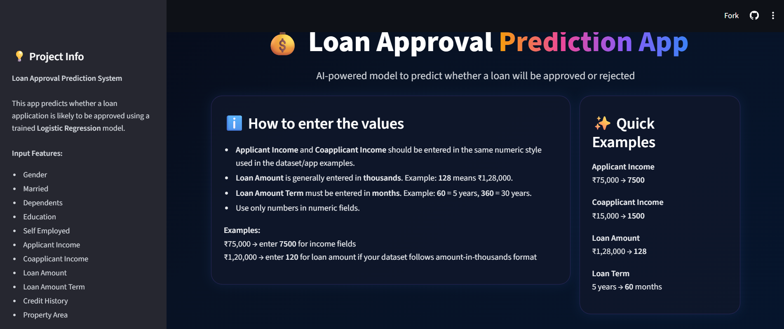
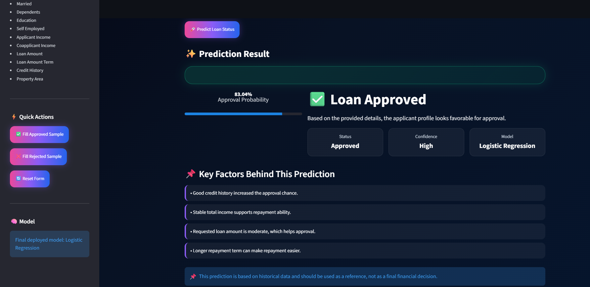

# 💰 Loan Approval Prediction System

A machine learning web application that predicts whether a loan application is likely to be **Approved** or **Rejected** based on applicant details such as income, loan amount, credit history, education, marital status, and property area.

This project was built as an **end-to-end machine learning project** covering:

- data cleaning & preprocessing
- exploratory data analysis (EDA)
- model training & evaluation
- model saving/loading
- Streamlit app development
- deployment-ready project structuring

---

## 🚀 Live Demo

🔗 **App Link:**  
https://loan-prediction-ml--model.streamlit.app

---

## 📌 Project Overview

The goal of this project is to build a machine learning model that can predict loan approval decisions using historical loan applicant data.

The project includes:

- EDA notebook for understanding the dataset
- preprocessing and feature engineering
- training a classification model
- saving the trained model and scaler
- building a Streamlit web app for predictions
- deploying the app online

---

## 🧠 Problem Statement

Financial institutions receive many loan applications, and manually checking each one takes time.  
This project automates the process by using a trained ML model to predict whether a loan should be approved based on applicant information.

---

## 📂 Dataset Features

The model uses the following input features:

- **Gender**
- **Married**
- **Dependents**
- **Education**
- **Self_Employed**
- **ApplicantIncome**
- **CoapplicantIncome**
- **LoanAmount**
- **Loan_Amount_Term**
- **Credit_History**
- **Property_Area**

### 🎯 Target Variable
- **Loan_Status** → Approved / Rejected

---

## 🛠️ Tech Stack

### Languages & Libraries
- **Python**
- **NumPy**
- **Pandas**
- **Scikit-learn**
- **Joblib**
- **Streamlit**

### Tools Used
- **Jupyter Notebook**
- **VS Code**
- **Git & GitHub**
- **Streamlit Cloud**

---

## 📁 Project Structure

```bash
loan-approval-ml-project/
│
├── app/
│   └── app.py                  # Streamlit app
│
├── artifacts/
│   ├── loan_model.pkl          # Trained ML model
│   └── scaler.pkl              # Saved scaler/preprocessor
│
├── data/
│   └── loan_data.csv           # Dataset
│
├── notebook/
│   ├── loan_approval_eda.ipynb
│   └── loan_approval_preprocessing.ipynb
│
├── src/
│   └── predict.py              # Prediction logic
│
├── requirements.txt           # Required libraries
├── .python-version            # Python version for deployment
├── .gitignore
└── README.md
```
---

## ⚙️ How the Project Works
**1. Data Collection**

The dataset contains loan application details such as applicant income, education, marital status, loan amount, and credit history.

**2. Data Cleaning & Preprocessing**

Performed steps such as:
- handling missing values
- encoding categorical variables
- scaling numerical features
- preparing final training data

**3. Exploratory Data Analysis (EDA)**

Used EDA to understand:
- distribution of applicant income
- relationship between credit history and loan approval
- approval trends across gender, education, and property area
- missing values and feature behavior

**4. Model Training**

A machine learning classification model was trained to predict whether a loan application would be approved or not.

**5. Model Saving**

The trained model and scaler were saved using joblib/pickle so they can be loaded in the Streamlit app.

**6. Streamlit App**

A user-friendly web interface was built where users can enter applicant details and get a prediction instantly.

---

## 🤖 Model Used  

Final model used in deployment:  

**Logistic Regression**  

Why this model?  
- simple and interpretable
- works well for binary classification
- performs well on this dataset
- supports probability prediction (`predict_proba()`)

---

## ▶️ How to Run the Project Locally
**1) Clone the repository**
```bash
git clone https://github.com/Prem-at-work/LOAN-Prediction-Model.git
cd LOAN-Prediction-Model
```
**2) Create a virtual environment**
```bash
python -m venv venv
```
**3) Activate the virtual environment**  
Windows
```bash
venv\Scripts\activate
```
Mac/Linux
```bash
source venv/bin/activate
```
**4) Install dependencies**
```bash
pip install -r requirements.txt
```
**5) Run the Streamlit app**
```bash
streamlit run app/app.py
```

---

## 🖥️ Streamlit App Inputs  

The app takes the following user inputs:

- Gender
- Married
- Dependents
- Education
- Self Employed
- Applicant Income
- Coapplicant Income
- Loan Amount
- Loan Amount Term
- Credit History
- Property Area  

After entering the details, the model predicts whether the loan is likely to be Approved or Rejected.

---

## 📊 Example Prediction Flow  

1. User enters applicant details in the Streamlit form
2. Input data is preprocessed/scaled
3. Saved model makes prediction
4. App displays final result:
   - ✅ Loan Approved
   - ❌ Loan Rejected

---

## 💡 Key Learning Outcomes  

This project helped me practice and understand:

- end-to-end ML workflow
- real-world data preprocessing
- EDA and feature understanding
- training and saving ML models
- integrating ML model with Streamlit
- project folder structuring
- deployment on Streamlit Cloud
- GitHub project management

---

## 📸 App Preview

### Home Page  


### Prediction Result  


---

## 🔮 Future Improvements

**Possible improvements for the project:**

- analyze feature dominance of `Credit_History` and compare model performance with/without it
- improve UI design further
- add visual analytics dashboard inside the app

---

## 👨‍💻 Author

**Prem**  

If you liked this project, feel free to connect or explore the repository.
